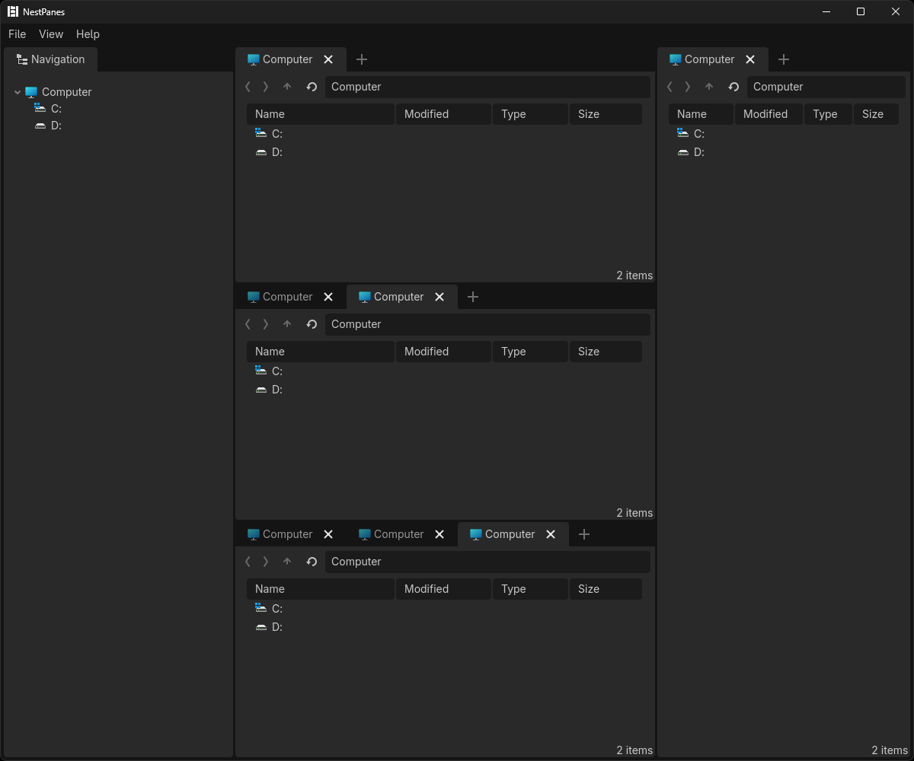

# NestPanes

[简体中文](README_zh.md) | English

A Windows desktop application based on the [Godot 4.6-stable source code](https://github.com/godotengine/godot/tree/4.6-stable).



## Features

**Core Features**

- File Management
	- File Browsing
		- List Sorting
		- Path History
	- File Navigation
	- Basic File Operations
		- Cut/Copy/Paste
		- Rename
		- Delete (Recycle Bin)
		- Create New File/Folder
		- Drag-and-Drop (Move/Copy)

**UI Layout**

- Multiple Tabs
- Splittable View
	- Drag-and-drop Tab Splitting
- Save & Restore

## Roadmap

- File Management
	- File Search
	- Image Preview
- Settings
- Themes

---

## Keyboard Shortcuts

| Action                   | Windows                 | Scope           |
| ------------------------ | ----------------------- | --------------- |
| New Tab                  | `Ctrl+T`                | Tabs            |
| Close Tab                | `Ctrl+W`                | Tabs            |
| Next Tab                 | `Ctrl+Tab`              | Tabs            |
| Previous Tab             | `Ctrl+Shift+Tab`        | Tabs            |
| Copy Path                | `Ctrl+Shift+C`          | File Management |
| Show in System Explorer  | `Ctrl+Alt+R`            | File Management |
| Open in External Program | `Ctrl+Alt+E`            | File Management |
| Open in Terminal         | `Ctrl+Alt+T`            | File Management |
| Cut                      | `Ctrl+X`                | File Management |
| Copy                     | `Ctrl+C`                | File Management |
| Paste                    | `Ctrl+V`                | File Management |
| Rename                   | `F2`                    | File Management |
| Delete                   | `Delete`                | File Management |
| Focus Address Bar        | `Ctrl+L`                | FilePane        |
| Previous Folder          | `Alt+Left`, `Backspace` | FilePane        |
| Next Folder              | `Alt+Right`             | FilePane        |
| Parent Folder            | `Alt+Up`                | FilePane        |
| Refresh                  | `F5`                    | FilePane        |
| Toggle Left Sidebar      | `Ctrl+B`                | Global          |
| Toggle Right Sidebar     | `Ctrl+Shift+B`          | Global          |
| Quit                     | `Ctrl+Q`                | Global          |

---

## Building from Source

### Environment Setup

Please refer to the Godot Engine development documentation for setup instructions.

### Building

```
scons
```

### Testing

Build with the `tests` flag:

```
scons tests=yes
```

Run the tests:

```
./bin/<binary> --test --test-case-exclude="*[PCKPacker]*"
```
