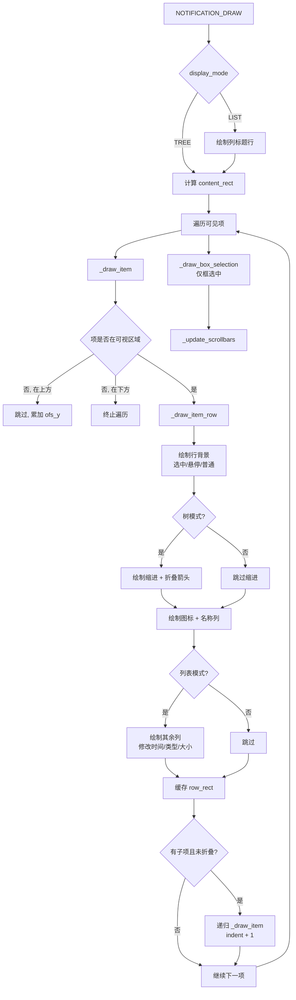
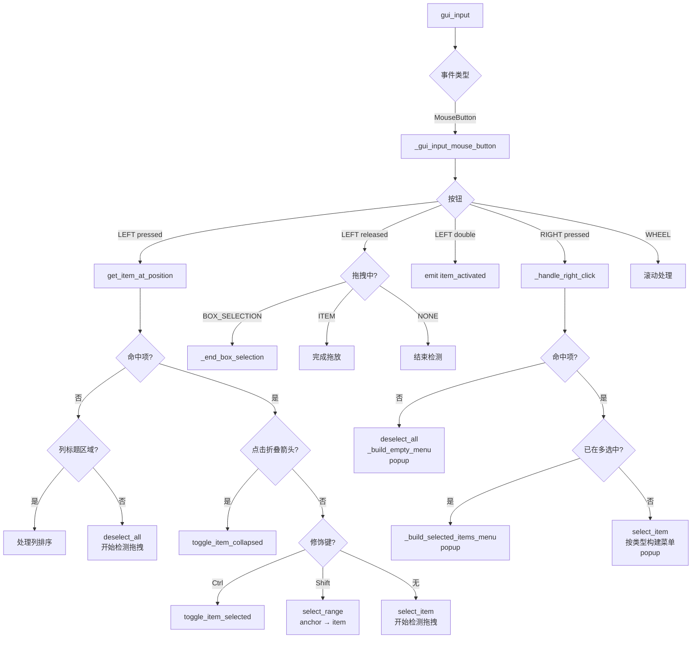
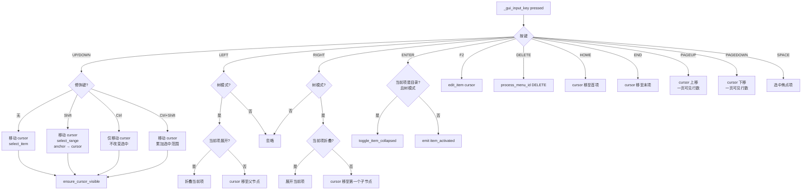
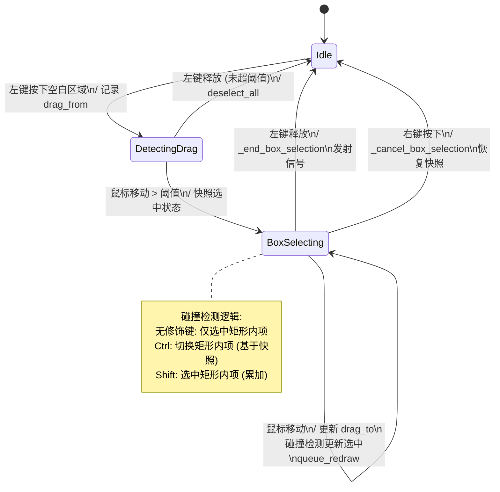
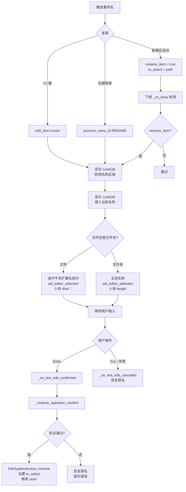
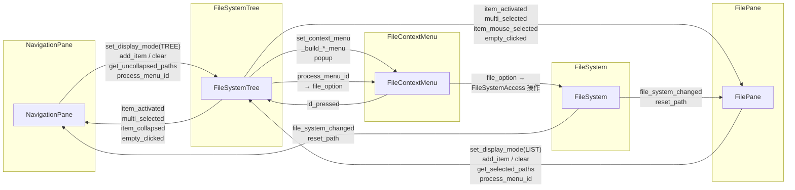

# 文件管理模块详细设计文档

| 属性         | 值           |
| ------------ | ------------ |
| **文档编号** | DDD-002      |
| **项目名称** | NestPanes    |
| **模块名称** | 文件管理模块 |
| **版本**     | v0.1         |
| **状态**     | 草稿         |
| **作者**     | Bay          |
| **最后更新** | 2026-04-09   |

---

## 一、概述

### 1.1 模块简介

**文件管理模块**（`app/app_modules/file_management/`）是 NestPanes 的核心业务模块，提供文件系统浏览、导航和操作功能。

模块结构：

```
file_management/
├── file_system.cpp/h           # 业务逻辑层（文件操作、快捷键、信号分发）
├── gui/
│   ├── file_pane.cpp/h         # 文件窗格（工具栏 + 文件列表）
│   ├── navigation_pane.cpp/h   # 导航窗格（文件树）
│   ├── file_system_tree.cpp/h  # 文件树/列表控件
│   ├── file_context_menu.cpp/h # 右键上下文菜单
│   └── address_bar.cpp/h      # 地址栏
├── tests/                      # 单元测试
└── SCsub
```

### 1.2 设计目标

- 文件系统操作与 UI 解耦，通过信号通信
- 文件管理 GUI 响应迅速，大目录采用分步扫描
- 常用操作与 Windows 文件资源管理器保持一致

### 1.3 关联文档

| 文档             | 编号    | 关联说明                                  |
| ---------------- | ------- | ----------------------------------------- |
| 产品需求文档     | PRD-001 | 文件管理功能需求定义 (3.2.1)              |
| 软件架构设计文档 | SAD-001 | 模块层次和依赖关系 (4.3.1)                |
| 详细设计文档     | DDD-001 | 根节点与布局框架设计（PaneBase 接口定义） |

---

## 二、类设计

### 2.1 类图

### 2.2 数据类详细说明

#### 类：`FileSystem`

| 属性     | 说明                                                         |
| -------- | ------------------------------------------------------------ |
| **文件** | `app/app_modules/file_management/file_system.cpp/h`          |
| **职责** | 文件管理的业务逻辑层，封装文件操作、管理通用快捷键和信号分发 |

**职责概述：**

```
- 封装 FileSystemAccess 提供业务层文件操作（剪切/复制/粘贴/删除/重命名/新建）
- 管理剪贴板状态（剪切/复制源路径列表）
- 管理撤销/恢复栈 - 参考 Windows 文件资源管理器实现
```

- 定义文件管理通用快捷键（Ctrl+C/X/V/Z/Y 等）
- 通过信号通知 GUI 组件文件变化

##### 快捷键

- 快捷键定义
	- FileSystem 中定义文件处理通用快捷键
	- 各个 Pane 中定义自身控件相关快捷键

---

#### 类：`FileSystemAccess`

| 属性     | 说明                                                         |
| -------- | ------------------------------------------------------------ |
| **文件** | `app/app_core/io/file_system_access.cpp/h`                   |
| **职责** | 文件系统操作的平台抽象层，定义统一接口，具体实现由平台层提供 |

**关键接口：**
- 目录遍历（获取目录内容、获取驱动器列表）
- 文件/目录操作（创建、删除、移动、复制、重命名）
- 系统图标获取（文件/文件夹/驱动器图标）

| 平台实现类              | 文件位置                                                         |
| ----------------------- | ---------------------------------------------------------------- |
| FileSystemAccessWindows | `app/app_core/platform/windows/file_system_access_windows.cpp/h` |

### 2.3 界面类详细说明

#### 类：`FileSystemTree`

| 属性     | 说明                                                         |
| -------- | ------------------------------------------------------------ |
| **文件** | `app/app_modules/file_management/gui/file_system_tree.cpp/h` |
| **职责** | 文件树/列表统一控件，支持树视图和列表视图两种显示模式        |

---

##### 设计背景

###### 树视图与列表视图实现方案

**采用单一类 `FileSystemTree`，通过配置参数切换显示模式**

理由：
1. 树视图和列表视图共享大量逻辑：选择、右键菜单、拖放、键盘导航、文件图标赋值等
2. 两者的主要差异仅在：是否显示展开/折叠箭头、是否展示子节点、布局排列方式
3. 统一类可避免交互逻辑的重复实现和同步维护问题

###### 继承基类选择：`Control`（而非 `Tree`）

初版实现继承自 Godot 内置 `Tree` 控件，在使用过程中暴露出以下无法在子类中解决的限制：

| #   | 限制                       | 具体问题                                                                                                                                     |
| --- | -------------------------- | -------------------------------------------------------------------------------------------------------------------------------------------- |
| 1   | **SelectMode 互斥**        | `Tree` 的 `SELECT_ROW` 与 `SELECT_MULTI` 互斥——列表视图需要按行选中，同时需要多选。目前只能取 `SELECT_ROW` 而放弃 `SELECT_MULTI`，反之亦然。 |
| 2   | **无法实现框选**           | `Tree` 的 `draw_item` 等绘制方法均为 **非虚函数**，子类无法覆盖绘制流程。                                                                    |
| 3   | **默认输入处理拦截快捷键** | `Tree::gui_input` 内置了增量搜索、方向键折叠/展开、PageUp/Down 等逻辑，这些行为会影响其他控件的键盘事件触发及处理。                          |

因此，计划将 `FileSystemTree` 的基类从 `Tree` 改为 `Control`，自行管理项数据、绘制、输入和滚动。

---

##### 交互事件矩阵 (Interaction Event Matrix) - 文件树

###### 鼠标操作矩阵

| 输入事件 \上下文                                  | 空白区域                                       | 单个文件项                                                                              | 单个文件夹/驱动器/此电脑项        | 多个选中项中的某项         |
| :------------------------------------------------ | :--------------------------------------------- | :-------------------------------------------------------------------------------------- | :-------------------------------- | :------------------------- |
| **左键单击**                                      | 取消所有选中                                   | 选中该项，取消其他选中；上报选中                                                        | 同左                              | 同目标项对应行为           |
| **Ctrl+左键单击**                                 | /                                              | 切换该项选中状态                                                                        | 同左                              | 同目标项对应行为           |
| **Shift+左键单击**                                | /                                              | 选中前一选中项到当前项间的所有项，取消其他选中                                          | 同左                              | 同目标项对应行为           |
| **左键双击**                                      | /                                              | 选中该项，取消其他选中；上报触发                                                        | 选中该项，取消其他选中；展开/折叠 | 同目标项对应行为           |
| **右键单击**                                      | 取消所有选中；弹出上下文菜单                   | 选中该项，取消其他选中；弹出上下文菜单                                                  | 同左                              | 弹出上下文菜单             |
| ~~右键按下拖拽~~ - 右键按下直接弹出右键菜单       | 框选，取消其他选；弹出上下文菜单               | 移动到目标位置/用目标应用打开                                                           | 同左                              | 所有选中项同目标项对应行为 |
| ~~Ctrl+右键按下拖拽~~ - 右键按下直接弹出右键菜单  | 框选，切换范围内目标项选中状态；弹出上下文菜单 | 复制到目标位置/用目标应用打开                                                           | 同左                              | 所有选中项同目标项对应行为 |
| ~~Shift+右键按下拖拽~~ - 右键按下直接弹出右键菜单 | 框选，选中范围内目标项；弹出上下文菜单         | 同未按下 Shift                                                                          | 同未按下 Shift                    | 同未按下 Shift             |
| **左键按下拖拽**                                  | 框选，取消其他选中                             | 未处于选中状态：框选，取消其他选中<br>已处于选中状态：移动到目标位置~~/用目标应用打开~~ | 同左                              | 所有选中项同目标项对应行为 |
| **左键按下拖拽+Ctrl（先按鼠标后按 Ctrl）**        | 框选，切换范围内目标项选中状态                 | 复制到目标位置~~/用目标应用打开~~                                                       | 同左                              | 所有选中项同目标项对应行为 |
| ~~Shift+左键按下拖拽~~                            | 框选，选中范围内目标项                         | 同未按下 Shift                                                                          | 同未按下 Shift                    | 同未按下 Shift             |
| **滚轮滚动**                                      | 列表滚动                                       | 同左                                                                                    | 同左                              | 同左                       |
| **Ctrl+滚轮滚动**                                 | /                                              | /                                                                                       | /                                 | /                          |
| **悬停(Hover)**                                   | /                                              | 显示提示                                                                                | 同左                              | 同目标项对应行为           |

###### 键盘操作矩阵

| 输入事件 \上下文        | 未选中                                         | 选中单个文件项             | 选中单个文件夹/驱动器/此电脑项             | 选中多个项                           |
| :---------------------- | :--------------------------------------------- | :------------------------- | :----------------------------------------- | ------------------------------------ |
| **Enter**               | /                                              | 上报触发                   | 展开/折叠                                  | ~~所有选中项~~焦点项同目标项对应行为 |
| **→**                   | /                                              | ~~无反应~~同 ↓             | 若折叠则展开，若展开则焦点移入第一个子节点 | 同 ↓                                 |
| **←**                   | /                                              | 焦点移至父节点             | 若展开则折叠，若折叠则焦点移至父节点       | 同左                                 |
| **↑ / ↓**               | 切换选中                                       | 同左                       | 同左                                       | 基于焦点项切换选中                   |
| ~~Ctrl+↑/↓~~            | 移动焦点                                       | 同左                       | 同左                                       | 同左                                 |
| ~~空格~~                | 选中焦点项                                     | /                          | /                                          | /                                    |
| **Shift+↑/↓**           | 选中前一选中项到当前项间的所有项，取消其他选中 | 同左                       | 同左                                       | 同左                                 |
| ~~Ctrl+Shift+↑/↓~~      | 移动焦点                                       | 选中焦点经过范围内的所有项 | 同左                                       | 同左                                 |
| **Delete**              | /                                              | 删除（回收站）             | 同左                                       | 所有选中项同目标项对应行为           |
| **F2**                  | /                                              | 重命名                     | 同左                                       | 焦点项重命名                         |
| **Ctrl+C**              | /                                              | 复制到剪贴板               | 同左                                       | 所有选中项同目标项对应行为           |
| **Ctrl+X**              | /                                              | 剪切到剪贴板               | 同左                                       | 所有选中项同目标项对应行为           |
| **Ctrl+V**              | /                                              | /                          | 粘贴到选中项中                             | /                                    |
| **Ctrl+A**              | /                                              | /                          | /                                          | /                                    |
| **Ctrl+Z** - 暂不支持   | 撤销操作                                       | 同左                       | 同左                                       | 同左                                 |
| **Ctrl+Y** - 暂不支持   | 恢复操作                                       | 同左                       | 同左                                       | 同左                                 |
| **Alt+Enter**- 暂不支持 | /                                              | 打开属性                   | 同左                                       | 焦点项打开属性                       |
| **Home**                | 跳至首项                                       | 同左                       | 同左                                       | 同左                                 |
| **End**                 | 跳至末项                                       | 同左                       | 同左                                       | 同左                                 |
| **PageUp**              | 上翻页                                         | 同左                       | 同左                                       | 同左                                 |
| **PageDown**            | 下翻页                                         | 同左                       | 同左                                       | 同左                                 |

##### 交互事件矩阵 (Interaction Event Matrix) - 文件列表

> 与文件树矩阵的关键差异：
> - 文件夹/驱动器的双击行为为"上报触发"（进入目录）而非"展开/折叠"
> - Ctrl+滚轮滚动用于切换查看方式（列表/详细信息）
> - Ctrl+A 全选和 Ctrl+V 粘贴到当前目录
> - 无左/右箭头键的展开/折叠操作

###### 鼠标操作矩阵

| 输入事件 \上下文                                  | 空白区域                                       | 单个文件项                                                                              | 单个文件夹/驱动器/此电脑项 | 多个选中项中的某项         |
| :------------------------------------------------ | :--------------------------------------------- | :-------------------------------------------------------------------------------------- | :------------------------- | :------------------------- |
| **左键单击**                                      | 取消所有选中                                   | 选中该项，取消其他选中；上报选中                                                        | 同左                       | 同目标项对应行为           |
| **Ctrl+左键单击**                                 | /                                              | 切换该项选中状态                                                                        | 同左                       | 同目标项对应行为           |
| **Shift+左键单击**                                | /                                              | 选中前一焦点项到当前项间的所有项，取消其他选中                                          | 同左                       | 同目标项对应行为           |
| **左键双击**                                      | /                                              | 选中该项，取消其他选中；上报触发                                                        | 同左                       | 同目标项对应行为           |
| **右键单击**                                      | 取消所有选中；弹出上下文菜单                   | 选中该项，取消其他选中；弹出上下文菜单                                                  | 同左                       | 弹出上下文菜单             |
| ~~右键按下拖拽~~ - 右键按下直接弹出右键菜单       | 框选，取消其他选；弹出上下文菜单               | 移动到目标位置/用目标应用打开                                                           | 同左                       | 所有选中项同目标项对应行为 |
| ~~Ctrl+右键按下拖拽~~ - 右键按下直接弹出右键菜单  | 框选，切换范围内目标项选中状态；弹出上下文菜单 | 复制到目标位置/用目标应用打开                                                           | 同左                       | 所有选中项同目标项对应行为 |
| ~~Shift+右键按下拖拽~~ - 右键按下直接弹出右键菜单 | 框选，选中范围内目标项；弹出上下文菜单         | 同未按下 Shift                                                                          | 同未按下 Shift             | 同未按下 Shift             |
| **左键按下拖拽**                                  | 框选，取消其他选                               | 未处于选中状态：框选，取消其他选中<br>已处于选中状态：移动到目标位置~~/用目标应用打开~~ | 同左                       | 所有选中项同目标项对应行为 |
| **左键按下拖拽+Ctrl（先按鼠标后按 Ctrl）**        | 框选，切换范围内目标项选中状态                 | 复制到目标位置~~/用目标应用打开~~                                                       | 同左                       | 所有选中项同目标项对应行为 |
| ~~Shift+左键按下拖拽~~                            | 框选，选中范围内目标项                         | 同未按下 Shift                                                                          | 同未按下 Shift             | 同未按下 Shift             |
| **滚轮滚动**                                      | 列表滚动                                       | 同左                                                                                    | 同左                       | 同左                       |
| **Ctrl+滚轮滚动** - 暂不支持                      | 切换查看方式                                   | 同左                                                                                    | 同左                       | 同左                       |
| **悬停(Hover)**                                   | /                                              | 显示提示                                                                                | 同左                       | 同目标项对应行为           |

###### 键盘操作矩阵

| 输入事件 \上下文        | 未选中                                         | 选中单个文件项             | 选中单个文件夹/驱动器/此电脑项 | 选中多个项                 |
| :---------------------- | :--------------------------------------------- | :------------------------- | :----------------------------- | -------------------------- |
| **Enter**               | /                                              | 上报触发                   | 同左                           | 所有选中项同目标项对应行为 |
| **→**                   | /                                              | 同 ↓                       | 同左                           | 同左                       |
| **←**                   | /                                              | 同 ↑                       | 同左                           | 同左                       |
| **↑ / ↓**               | 切换选中                                       | 同左                       | 同左                           | 基于焦点项切换选中         |
| **Ctrl+↑/↓**            | 移动焦点                                       | 同左                       | 同左                           | 同左                       |
| **空格**                | 选中焦点项                                     | /                          | /                              | /                          |
| **Shift+↑/↓**           | 选中前一选中项到当前项间的所有项，取消其他选中 | 同左                       | 同左                           | 同左                       |
| ~~Ctrl+Shift+↑/↓~~      | 移动焦点                                       | 选中焦点经过范围内的所有项 | 同左                           | 同左                       |
| **Delete**              | /                                              | 删除（回收站）             | 同左                           | 所有选中项同目标项对应行为 |
| **F2**                  | /                                              | 重命名                     | 同左                           | 焦点项重命名               |
| **Ctrl+C**              | /                                              | 复制到剪贴板               | 同左                           | 所有选中项同目标项对应行为 |
| **Ctrl+X**              | /                                              | 剪切到剪贴板               | 同左                           | 所有选中项同目标项对应行为 |
| **Ctrl+V**              | 粘贴到当前目录                                 | 同左                       | 同左                           | 同左                       |
| **Ctrl+A** - 暂不支持   | 全选当前目录                                   | 同左                       | 同左                           | 同左                       |
| **Ctrl+Z**- 暂不支持    | 撤销操作                                       | 同左                       | 同左                           | 同左                       |
| **Ctrl+Y**- 暂不支持    | 恢复操作                                       | 同左                       | 同左                           | 同左                       |
| **Alt+Enter**- 暂不支持 | /                                              | 打开属性                   | 同左                           | 焦点项打开属性             |
| **Home**                | 跳至首项                                       | 同左                       | 同左                           | 同左                       |
| **End**                 | 跳至末项                                       | 同左                       | 同左                           | 同左                       |
| **PageUp**              | 上翻页                                         | 同左                       | 同左                           | 同左                       |
| **PageDown**            | 下翻页                                         | 同左                       | 同左                           | 同左                       |

---

##### 参考图表

###### 绘制流程



---

###### 鼠标输入处理流程



###### 键盘输入处理流程



---

###### 框选状态机



---

###### 重命名流程



---

###### 外部组件交互



---

#### 类：`FileContextMenu`

| 属性     | 说明                                                          |
| -------- | ------------------------------------------------------------- |
| **文件** | `app/app_modules/file_management/gui/file_context_menu.cpp/h` |
| **职责** | 根据上下文（空白区域/文件/文件夹/多选）动态生成右键菜单       |

- 枚举与功能实现
	- 打开 - 外部处理
	- [x] 在新标签页中打开
	- 在新窗口中打开 - 暂不添加该菜单项
		- 需增加命令行参数处理
	---
	- [x] 在系统默认应用中打开
	---
	- [x] 在终端中打开
	- [x] 在系统文件浏览器中显示
	---
	- [x] 复制文件地址
		- 复制文本和`Windows`文件管理器复制内容保持一致（路径分隔符）？
	---
	- 撤销
	- 恢复
	---
	- [x] 剪切
	- [x] 复制
	- [x] 粘贴
	---
	- [x] 删除
	- 重命名 - 外部处理
		- 需要对项目进行编辑
	---
	- 新建 - 外部处理，需要对项目进行编辑
		- 文件夹
		- 文件

---

#### 类：`NavigationPane`

| 属性     | 说明                                                        |
| -------- | ----------------------------------------------------------- |
| **文件** | `app/app_modules/file_management/gui/navigation_pane.cpp/h` |
| **职责** | 导航窗格，展示文件系统树状结构（驱动器/文件夹）             |

- 文件系统树
	- 更新逻辑
		- 初始化 - 完整更新
		- 用户展开文件夹 - 更新对应文件夹
		- 已展开文件夹在系统中产生变化 - 更新对应文件夹及其它展开的子文件夹
		- 主题样式改变 - 完整更新

##### 右键菜单项

- 空白区域
	- 展开到当前文件夹（实测只会展开至当前标签页的文件夹，其它的文件夹会折叠）（Obsidian - 自动显示当前文件） - 勾选框
- 多选
	- [x] 剪切
	- [x] 复制
	- [x] （粘贴）
	- -
	- [x] 删除
- 驱动
- 文件夹
	- 展开/折叠
	- -
	- [ ] 打开
	- [ ] 在新标签页中打开
		- 实现导航窗格关联文件窗格功能时添加
	- [ ] 在新窗口中打开
	- 固定到快速访问
	- -
	- [x] 新建文件夹
	- [x] 新建文件
	- -
	- [x] 复制文件地址
	- -
	- [x] 在终端中打开
	- [x] 在系统文件浏览器中显示
	- -
	- [x] 剪切
	- [x] 复制
	- [x] （粘贴）
	- -
	- [x] 重命名
	- [x] 删除
- 文件
	- [x] 打开
	- 用系统应用开启？ - 勾选框
		- 未勾选：在应用内新建标签页开启图片/文本
		- 勾选：不新建标签页直接在系统中开启
	- -
	- [x] 复制文件地址
	- -
	- [x] 在系统文件浏览器中显示
	- -
	- [x] 剪切
	- [x] 复制
	- -
	- [x] 重命名
	- [x] 删除

---

#### 类：`FilePane`

| 属性     | 说明                                                  |
| -------- | ----------------------------------------------------- |
| **文件** | `app/app_modules/file_management/gui/file_pane.cpp/h` |
| **职责** | 文件窗格，包含工具栏和文件列表，支持导航和文件操作    |

- 工具栏、文件列表 - 文件列表可以根据文件树实现方案考虑换成用文件树展示文件，可以设置是否显示展开按钮
	- 更新逻辑
		- 初始化 - 完整更新
		- 路径改变 - 完整更新
			- 地址栏输入回车
			- 选择历史路径
			- 导航按钮返回/前进/上一级按钮
			- 双击文件夹
		- 刷新 - 完整更新（如果当前路径不存在了则需要移动到存在的上级目录）
			- 刷新按钮
		- 当前所在路径中的文件/文件夹在系统中产生变化 - 更新文件列表
		- 主题样式改变 - 完整更新
	- 工具栏 Toolbar - 不编写独立的类，避免名称和其它工具栏冲突，仅在窗格中用容器类变量的变量名表示
		- 导航按钮
			- 返回
			- 前进
			- 上一级
				- 返回上级菜单时选中刚才的文件夹
			- 刷新
		- 地址栏
			- 不包含下拉按钮，点击文本进入编辑状态时自动展开历史路径弹出框
			- 进入编辑状态时自动全选
			- 支持面包屑/输入模式
			- 路径格式`/`和`\`
			- 地址栏输入校验和格式化
		- 搜索栏/功能按钮 - 待定

##### 右键菜单项

- 空白区域
	- 查看
		- 列表
		- 详细信息
	- 排序方式
	- -
	- [x] （粘贴）
		- 同一目录粘贴自动重命名后粘贴
	- （撤销）
	- （恢复）
	- [x] 新建
		- 导航树中不用二级菜单，这里保持二级菜单
		- [x] 文件夹
		- [x] 文件
			- 文本文件？
	- -
	- [x] 在终端中打开
- 多选
	- [x] 剪切
	- [x] 复制
	- [x] （粘贴）
	- -
	- [x] 删除
- 驱动
- 文件夹
	- [x] 打开
	- [x] 在新标签页中打开
	- [ ] 在新窗口中打开
		- 暂不添加该菜单项
	- 固定到快速访问
	- -
	- [x] 复制文件地址
	- -
	- [x] 在终端中打开
	- [x] 在系统文件浏览器中显示
	- -
	- [x] 剪切
	- [x] 复制
	- [x] （粘贴）
	- -
	- [x] 重命名
	- [x] 删除
- 文件
	- [x] 打开
	- 用系统应用开启？ - 勾选框
	- -
	- [x] 复制文件地址
	- -
	- [x] 在系统文件浏览器中显示
	- -
	- [x] 剪切
	- [x] 复制
	- -
	- [x] 重命名
	- [x] 删除
---

#### 类：`AddressBar`

| 属性     | 说明                                                    |
| -------- | ------------------------------------------------------- |
| **文件** | `app/app_modules/file_management/gui/address_bar.cpp/h` |
| **职责** | 地址栏控件，支持面包屑导航和直接输入路径两种模式        |

**功能：**
- **面包屑模式**（默认）：将路径分段显示为可点击的按钮，点击某段可快速跳转到对应目录
- **输入模式**：点击面包屑文本区域进入编辑状态，可直接输入路径
- 进入编辑状态时自动全选路径文本
- 弹出历史路径下拉框供快速选择
- 路径输入校验：校验路径是否合法/存在，格式化路径分隔符（`/` 和 `\` 统一处理）
- 回车确认导航，Esc 取消编辑回到面包屑模式
